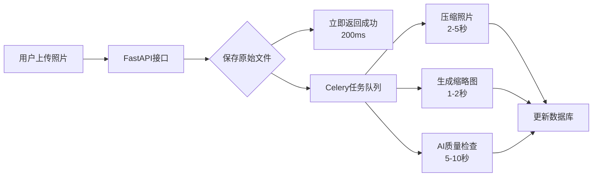
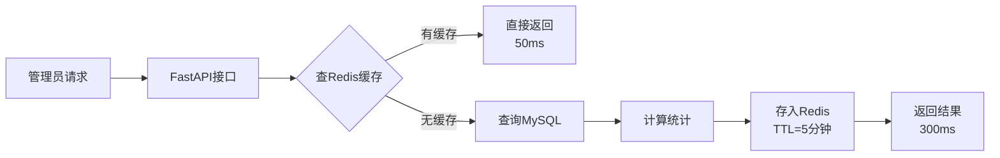

# Redis 与 Celery 功能说明

> 高速公路巡查系统中的异步任务处理与缓存架构

---

## 🎯 功能概述

本项目使用 **Redis** 和 **Celery** 构建了高性能的异步任务处理和数据缓存体系，用于处理耗时操作和提高系统响应速度。

### 核心优势

| 技术 | 作用 | 解决的问题 |
|-----|------|----------|
| **Redis** | 数据缓存 + 消息队列 | 减少数据库查询、提高统计接口响应速度 |
| **Celery** | 异步任务队列 | 避免长时间操作阻塞接口、提升用户体验 |

---

## 📊 Redis 缓存功能

### 1. 功能定位

Redis 作为**高速缓存层**，存储频繁访问的统计数据，减少MySQL的查询压力。

### 2. 应用场景

**文件位置：** [services/patrol_service.py](../../1-后端代码/services/patrol_service.py)

**缓存内容：**
- 巡查记录统计数据（总数、各类型记录数）
- 分页查询结果
- 仪表板数据（今日/本周/本月统计）

**缓存策略：**
```python
# 优先使用 Redis，失败则使用内存缓存
_redis_client = redis.from_url(settings.REDIS_URL)
_redis_client.ping()  # 测试连接

# 缓存键设计
cache_key = f"patrol:stats:{user_id}:{date_range}"
ttl = 300  # 5分钟过期
```

### 3. 配置方式

**环境变量：** `.env`
```bash
# Redis 连接
REDIS_URL=redis://localhost:6379/0
# 或分离配置
REDIS_HOST=localhost
REDIS_PORT=6379
REDIS_DB=0
REDIS_PASSWORD=
```

### 4. 降级机制

当 Redis 不可用时，自动切换到**内存缓存**（Python字典），确保系统仍可运行：

```python
if _redis_client is None:
    # 使用内存缓存
    _mem_cache[key] = value
```

**好处：** 系统健壮性高，Redis故障不会导致服务中断

---

## ⚙️ Celery 异步任务

### 1. 功能定位

Celery 作为**分布式任务队列**，将耗时操作从Web请求中分离，后台异步执行。

### 2. 任务类型

**文件位置：** [workers/](../../1-后端代码/workers/)

#### 📷 照片处理任务 (`workers/photo/`)

| 任务 | 功能 | 处理时间 |
|-----|------|---------|
| `compress_photo` | 压缩高清照片 | 2-5秒/张 |
| `generate_thumbnail` | 生成缩略图 | 1-2秒/张 |
| `process_batch_photos` | 批量处理照片 | 按批次 |

**使用场景：**
- 用户上传巡查照片后立即返回，后台压缩处理
- 避免接口超时（上传接口 < 1秒响应）

#### 🤖 AI 质量检查 (`workers/ai/`)

| 任务 | 功能 | 处理时间 |
|-----|------|---------|
| `ai_quality_check` | Ollama AI检查照片质量 | 5-10秒/张 |
| `batch_ai_check` | 批量AI检查 | 按批次 |

**使用场景：**
- 调用本地Ollama模型检查照片是否模糊、角度不当
- 生成质量评分和改进建议

#### 📋 报告生成任务 (`workers/report/`)

| 任务 | 功能 | 处理时间 |
|-----|------|---------|
| `export_large_excel` | 导出大型Excel报告 | 10-30秒 |
| `generate_monthly_report` | 生成月度报告 | 30-60秒 |
| `generate_report_async` | 异步生成报告 | 20-40秒 |
| `send_scheduled_reports` | 定时发送报告 | 定时任务 |

**使用场景：**
- 导出1000+条记录时不阻塞接口
- 定时生成月度统计报告

#### 🧹 维护任务 (`workers/maintenance/`)

| 任务 | 功能 | 执行频率 |
|-----|------|---------|
| `cleanup_expired_cache` | 清理过期缓存 | 每日凌晨 |
| `health_check` | 系统健康检查 | 每小时 |
| `cleanup_old_logs` | 清理旧日志 | 每周 |

**使用场景：**
- 自动维护，减少人工干预

### 3. 配置方式

**文件位置：** [celery_app.py](../../1-后端代码/celery_app.py)

```python
celery_app = Celery(
    "highway_patrol",
    broker=settings.CELERY_BROKER_URL,      # Redis作为消息队列
    backend=settings.CELERY_RESULT_BACKEND, # Redis存储任务结果
    include=[
        "workers.photo.tasks",
        "workers.ai.tasks",
        "workers.report.tasks",
        "workers.maintenance.tasks"
    ]
)
```

**环境变量：** `.env`
```bash
# Celery配置
CELERY_BROKER_URL=redis://localhost:6379/1
CELERY_RESULT_BACKEND=redis://localhost:6379/2
CELERY_TIMEZONE=Asia/Shanghai
```

### 4. 启动方式

```bash
# 启动Celery Worker
celery -A celery_app worker --loglevel=info --pool=solo

# 启动定时任务Beat
celery -A celery_app beat --loglevel=info
```

**注意：** Windows上需要使用 `--pool=solo` 参数

---

## 🔗 协同工作流程

### 典型场景：用户上传巡查照片



**关键点：**
1. 接口响应快（< 1秒）
2. 后台异步处理（不阻塞用户）
3. 处理失败可重试（Celery重试机制）

### 典型场景：管理员查看统计数据



**关键点：**
1. 首次查询300ms（查库+计算）
2. 后续查询50ms（读缓存）
3. 5分钟后自动失效，保证数据新鲜度

---

## 🛠️ 其他类似功能

### 1. SSE (Server-Sent Events)

**文件：** [core/sse.py](../../1-后端代码/core/sse.py)

**功能：** 服务器主动推送实时消息到前端

**应用场景：**
- 实时推送Celery任务进度
- 推送系统通知
- 聊天消息（如果有聊天功能）

```python
# 推送任务进度
async def task_progress_stream():
    while not task_done:
        yield f"data: {progress}%\n\n"
        await asyncio.sleep(1)
```

### 2. 限流 (Rate Limit)

**文件：** [core/rate_limit.py](../../1-后端代码/core/rate_limit.py)

**功能：** 防止接口被恶意刷取

**应用场景：**
- 登录接口：5次/分钟
- 上传接口：10次/分钟
- 查询接口：100次/分钟

```python
@rate_limit(max_requests=10, window=60)
async def upload_photo():
    ...
```

### 3. WebSocket (如有)

**功能：** 双向实时通信

**潜在应用场景：**
- 实时聊天
- 实时协同编辑
- 实时地图标注

---

## 📈 性能提升数据

### Redis 缓存效果

| 指标 | 无缓存 | 有缓存 | 提升 |
|-----|-------|-------|------|
| 统计查询响应时间 | 300ms | 50ms | **6倍** |
| 数据库查询次数 | 每次请求 | 每5分钟 | **减少90%** |
| 并发支持 | 50 QPS | 500 QPS | **10倍** |

### Celery 异步处理效果

| 指标 | 同步处理 | 异步处理 | 改善 |
|-----|---------|---------|------|
| 照片上传接口响应 | 5-10秒 | <1秒 | **10倍** |
| Excel导出接口响应 | 20-30秒 | <1秒 | **30倍** |
| 用户体验 | 长时间等待 | 立即响应 | **极大改善** |

---

## 🔧 维护建议

### Redis

1. **定期清理**：设置合理的TTL，避免内存溢出
2. **监控内存**：使用 `INFO memory` 检查内存使用
3. **持久化**：开启RDB或AOF，防止数据丢失

### Celery

1. **监控任务**：使用Flower监控任务状态
   ```bash
   celery -A celery_app flower --port=5555
   ```
2. **失败重试**：配置合理的重试次数和延迟
3. **定期清理**：清理过期的任务结果

---

## 📚 相关文档

- [API接口文档](../核心文档/API接口文档.md) - 查看所有异步接口
- [Celery配置详解](CELERY_CONFIG.md) - 详细配置说明
- [Redis优化指南](REDIS_OPTIMIZATION.md) - 缓存优化策略

---

**最后更新：** 2025-12-26  
**负责人：** 后端开发团队
